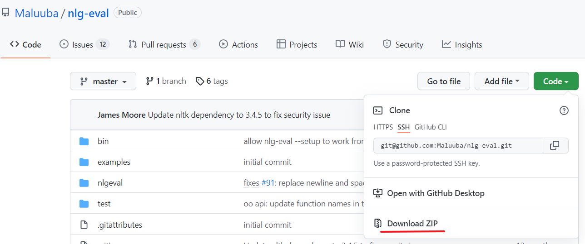

## 1 下载



## 2 安装

cd到解压后的nlg-eval-master文件夹，然后执行命令

```
python setup.py install
```

## 3 更改numpy包的版本

pip install --upgrade numpy==1.20.3

## 4 指定数据文件路径

在/home/username/.config/nlgeval/rc.json文件中添加

```
{"data_path": "/home/username/.cache/nlgeval"}
```

## 5 下载文件

向/home/username/.cache/nlgeval中添加文件，这里给出文件的百度网盘链接

链接：https://pan.baidu.com/s/1zpOxuHmVJjzsMvv8d2M_NA    提取码：z7un 

## 6 下载nltk_data的一些包

根据nltk_data报错的提示来下载吧，如果因为网络下载不了，可以在本地下载好传过去

